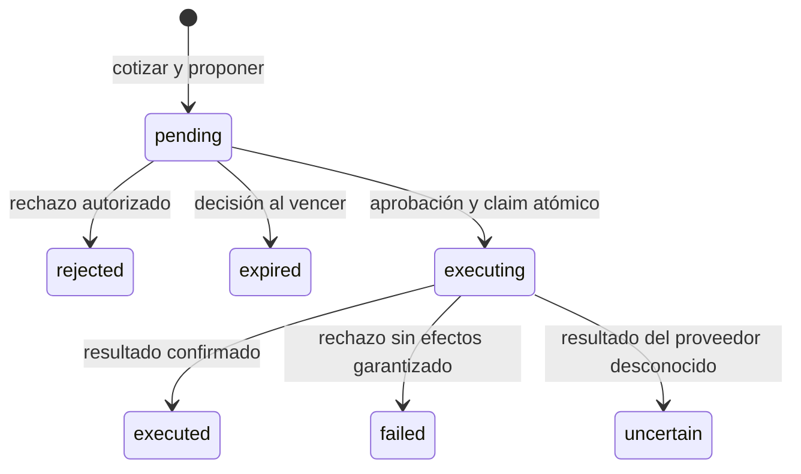

# Arquitectura y decisiones

## Un servicio, cuatro límites de integración

El objetivo es llegar a una demostración verificable y permitir sustituir infraestructura
sin reescribir las reglas de aprobación. Un servicio Python evita introducir colas,
microservicios, un gateway MCP o un framework multiagente sin un caso que los necesite.

La separación toma como referencias conceptuales la división interfaz/agente/operaciones
y los flujos de propuesta/aprobación/trazabilidad. No reutiliza implementaciones ajenas.

- **Dominio:** dataclasses y reglas de negocio, sin FastAPI, SQLite ni SDK de IA.
- **Servicio:** coordina puertos, permisos, vencimiento y resultados de ejecución.
- **API:** valida DTO, autentica y serializa. Los modelos OpenAPI son el contrato del frontend.
- **Adaptadores:** convierten cada contrato a la infraestructura elegida.
- **Bootstrap:** composición explícita; una fábrica confiable devuelve `Adapters`.

El frontend está deliberadamente pendiente. Debe representar propuestas y estados, no
calcular precios ni autorizar acciones. El asistente actual solo devuelve `SearchIntent`;
esta restricción es la primera frontera de seguridad, no un prompt que pide obediencia.

## Reserva supervisada

La propuesta dura 300 segundos. El vencimiento es **perezoso**: se marca `expired` al
intentar decidir; no hay scheduler. El cliente debe mostrar el reloj usando `expires_at`.
La propuesta no reserva stock ni congela condiciones en el proveedor: es una vista previa.
Cada cambio de stock invalida las propuestas basadas en esa versión, incluso si todavía
quedan suficientes unidades. Esta regla conservadora prioriza que se apruebe una vista vigente.

La aprobación no acepta precio, cantidad ni SKU nuevos. Se ejecuta el payload persistido,
y comercio vuelve a verificar versión, precio y disponibilidad dentro de su transacción.
Cambiar una propuesta significa crear otra con otra clave y volver a confirmarla.

## Garantías y límites

| Aspecto | Implementado en demo | Requisito para proveedores reales |
| --- | --- | --- |
| Identidad | Tokens fijos, roles y propietario de propuesta | Validar tokens, vigencia, audiencia y permisos en servidor |
| Precio | Centavos enteros USD, sin impuestos/promociones | Cotización autoritativa, moneda y reglas comerciales explícitas |
| Stock | Transacción SQLite con versión y disponibilidad | Escritura condicional/transacción en el sistema propietario |
| Duplicados | Clave por actor/payload y operación por ID de propuesta | Dedupe persistente en el proveedor con clave estable |
| Concurrencia | Claim atómico: solo un proceso despacha | Compare-and-set o transacción equivalente en el store |
| Auditoría | Eventos de transición persistidos | Retención, acceso restringido y protección contra alteraciones |
| Recuperación | Sin reintento de estados ambiguos | Consulta/reconciliación por ID de operación |

`DomainError` desde comercio afirma que **no hubo efecto**. Timeout, caída de red y error
desconocido no permiten afirmarlo: pasan a `uncertain`. Si el proceso muere después del
claim o entre la reserva y `finish`, puede quedar `executing`. En ambos casos se debe
consultar al proveedor por el ID de propuesta y reconciliar; no existe aún una herramienta
automática para hacerlo. No cambiar el estado a mano para intentar la reserva otra vez.

No se promete “exactly once” entre sistemas distribuidos. Las dos barreras de idempotencia
reducen duplicados, pero un adaptador que no cumple el contrato invalida esa garantía.
SQLite persiste operaciones en disco; no es la propuesta de infraestructura para múltiples
sedes, réplicas o alto volumen. Cada operación abre/cierra su conexión y las escrituras
usan `BEGIN IMMEDIATE`; no hay conexiones compartidas entre threads.

## Seguridad del dominio

Hay tres roles: `viewer` consulta, `clerk` propone y decide sus propias propuestas,
`supervisor` puede decidir y consultar propuestas de otros. **No es doble aprobación**:
el mismo dependiente puede proponer y aprobar. Una política de doble control es un futuro
cambio de dominio, no una opción ya implementada.

El despliegue representa **una sola organización**. `branch_id` identifica sucursales,
no tenants ni ámbitos de autorización. No hay restricción de usuario por sucursal.
No utilizar esta base compartida por varias organizaciones antes de diseñar ese aislamiento.

No se almacenan mensajes del asistente, tokens ni datos de pacientes. El historial contiene
solo identificador, actor, tipo y tiempo de cada transición. Es append-only desde la API,
no un registro criptográficamente inmutable. Las lecturas y autenticaciones fallidas no
se registran en ese historial. La propuesta conserva la cotización original.

## Interfaz futura

Consumir `/openapi.json`; no importar adaptadores ni consultar SQLite desde el navegador.
Mostrar fuente, hora, sucursal, unidad, cantidad y precio antes de habilitar aprobación.
Al ver `executing`, consultar `GET /proposals/{id}`; al ver `uncertain`, mostrar revisión
pendiente, nunca un botón que reenvíe como nueva reserva. Conservar la misma clave de
idempotencia al repetir una petición idéntica tras un corte de red.

No hay CORS habilitado: servir la interfaz en el mismo origen o configurar explícitamente
los orígenes autorizados al integrarla. No añadir `*` con credenciales como atajo.

## Fuera de alcance

Consejo clínico, dosificación, sustitución terapéutica, recetas, historial de compras real,
listas segmentadas de precios, fidelización, pagos, cancelación de reservas y expiración
de reservas en el proveedor. La expiración implementada es de **propuestas**, no de stock
reservado. El recibo demo no tiene valor comercial. Estas funciones requieren diseño,
datos autorizados y validación adicionales.
